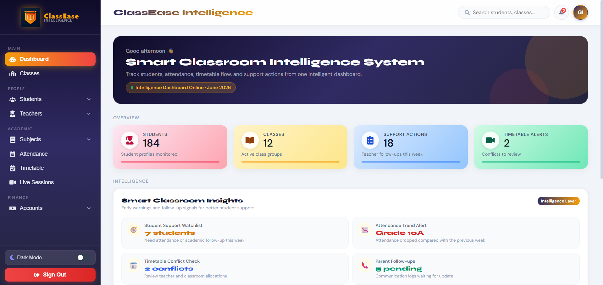

# ClassEase — Smart Classroom Intelligence System

<p align="center">
  
</p>

ClassEase is a smart classroom management and intelligence system built with React, Vite, and Firebase. It is designed to support real-world classroom operations through role-based access, academic workflow management, attendance tracking, finance monitoring, and intelligent classroom insights.

Unlike a basic CRUD application, ClassEase provides separate workflows for administrators, teachers, and students. Admins manage the overall system, teachers manage academic activities, and students access their personal learning information through a clean and responsive interface.

## Live Demo

Live Demo: Add your Vercel deployment link here

## Project Overview

ClassEase focuses on building a modern digital classroom environment where educational institutions can manage students, teachers, classes, subjects, timetables, attendance, assignments, marks, live sessions, fees, expenses, and academic progress from one platform.

The system includes role-based dashboards, protected routes, professional navigation, and smart classroom insights to make the application more realistic and industry-ready.

## Role-Based Access

ClassEase supports three main user roles:

### Admin

The admin has full access to the system and can manage all major modules.

Admin can:

* Manage student records
* Manage teacher records
* Manage classes and subjects
* Manage timetable schedules
* Monitor attendance
* Manage live sessions
* Track fees collection
* Manage expenses
* Access profile and system settings
* View smart classroom insights

### Teacher

The teacher has access to academic and classroom-related features.

Teacher can:

* View assigned classes
* View students
* Manage assignments
* Manage practical papers
* Manage revision papers
* Manage term-test papers
* Add and update student marks
* Mark attendance
* Manage live sessions
* Add academic support notes
* View class timetable

### Student

The student has view-only access to personal academic information.

Student can:

* View personal dashboard
* View class timetable
* View assignments and papers
* View marks and term-test results
* View attendance details
* View live sessions
* View fee status
* Manage profile and settings

Students cannot edit teacher-managed academic records.

## Key Features

* Firebase Authentication
* Firestore user role handling
* Role-based dashboard redirection
* Protected routes for admin, teacher, and student users
* Professional grouped sidebar navigation
* Admin classroom intelligence dashboard
* Student add, list, and profile management
* Teacher academic workspace
* Student learning portal
* Assignment and paper management
* Term-test marks management
* Attendance status tracking
* Live session scheduling
* Fees collection management
* Expense management
* Dark mode support
* Mobile responsive interface
* Smart classroom insights

## Intelligent Classroom Features

ClassEase includes intelligence-focused features that make the system more realistic and professional:

* Student support watchlist
* Attendance trend alerts
* Timetable conflict indicators
* Parent follow-up indicators
* Academic progress tracking
* Teacher-managed assessment records
* Student view-only learning portal
* Role-based academic workflows

## Teacher Workflow

Teachers can create and manage academic activities such as:

* Assignments
* Practical papers
* Revision papers
* Term-test papers
* Due dates
* Maximum marks
* Student marks
* Grades
* Teacher remarks
* Academic support alerts

This allows teachers to manage classroom learning activities in a structured and realistic way.

## Student Workflow

Students can view their own learning information, including:

* Class timetable
* Assignments and papers
* Marks and term-test results
* Attendance percentage
* Live sessions
* Fee status
* Profile information

The student portal is designed as a read-only academic dashboard, meaning students can view their information but cannot modify teacher-managed data.

## Main Modules

### Authentication Module

Users can register and log in using Firebase Authentication. Each user has a role such as admin, teacher, or student. After login, the system redirects users to the correct dashboard based on their role.

### Student Management Module

Admins can add, view, update, and manage student records. Student profiles include personal, academic, contact, and guardian information.

### Teacher Management Module

Admins can manage teacher records. Teachers can access a separate academic workspace after login.

### Academic Management Module

Admins can manage classes, subjects, and timetables. This module supports the academic structure of the classroom system.

### Attendance Module

Attendance can be tracked using statuses such as Present, Absent, Late, and Excused. The system helps monitor attendance and identify students who may need follow-up.

### Assignment and Paper Module

Teachers can create assignments, practical papers, revision papers, and term-test papers. Students can view the assigned work from their own dashboard.

### Marks and Progress Module

Teachers can manage assignment marks and term-test marks. Students can view their academic progress in a read-only format.

### Live Sessions Module

Teachers and admins can manage online class sessions. Students can view live session details and meeting links.

### Finance Module

The finance module includes fees collection and expense management. Admins can track paid, partial, and pending fee records as well as institutional expenses.

## Tech Stack

* React
* Vite
* Firebase Authentication
* Firestore
* React Router
* React Icons
* CSS
* LocalStorage for demo module persistence

## Project Structure

```bash
Classroom_Managment/
│
├── public/
├── src/
│   ├── Components/
│   ├── Pages/
│   ├── contexts/
│   ├── firebase.js
│   ├── App.jsx
│   └── main.jsx
│
├── package.json
├── vite.config.js
└── README.md
```

## How to Run the Project

Clone the repository:

```bash
git clone https://github.com/GimhaniDilmika/Classroom_Managment.git
```

Go to the project folder:

```bash
cd Classroom_Managment
```

Install dependencies:

```bash
npm install
```

Run the development server:

```bash
npm run dev
```

Open the local URL shown in the terminal.

## Build the Project

To create a production build:

```bash
npm run build
```

## Firebase Setup

This project uses Firebase Authentication and Firestore.

Required Firebase services:

* Firebase Authentication
* Firestore Database

For role-based access, each user should have a role stored in the `users` collection.

Example user document:

```js
{
  name: "Admin User",
  email: "admin@gmail.com",
  role: "admin",
  status: "active"
}
```

Available roles:

```text
admin
teacher
student
```

## Demo Role Setup

Create users from the Register page or Firebase Authentication.

Example demo accounts:

```text
admin@gmail.com / 123456     → Admin Dashboard
teacher@gmail.com / 123456   → Teacher Dashboard
student@gmail.com / 123456   → Student Dashboard
```

Firebase passwords must be at least 6 characters.

## Notes

Student records are connected with Firebase in the existing project flow. Attendance, live sessions, assignments, marks, fees, and expenses include complete front-end workflows with local persistence, making them ready for later Firestore integration.

## Future Improvements

* Parent portal
* PDF report generation
* Full Firestore integration for all demo modules
* Notification system
* Assignment file upload support
* Exportable marksheets
* Attendance reports
* Student progress reports
* Advanced analytics dashboard
* Student support prediction system

## Project Purpose

The purpose of ClassEase is to provide a modern, intelligent, and role-based classroom management solution for schools, institutes, and educational organizations. It helps admins manage operations, teachers manage academic workflows, and students track their learning progress through a professional and responsive web interface.
