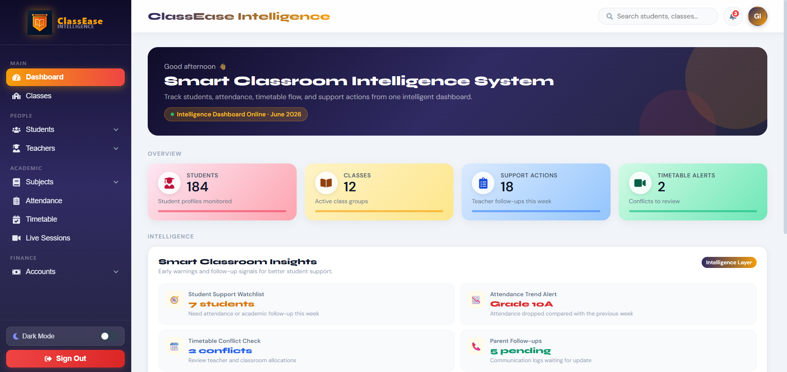
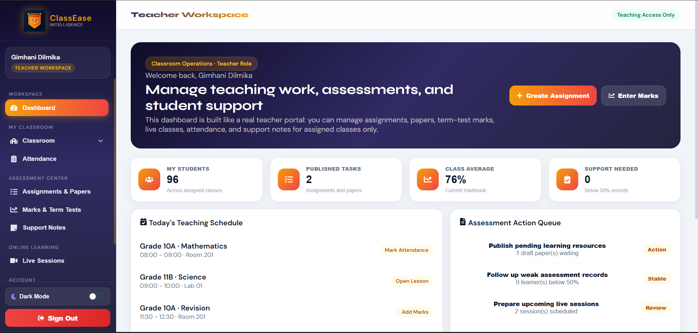
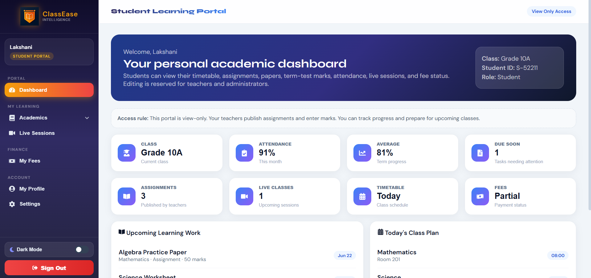

<p align="center">
  
</p>

<h1 align="center">ClassEase — Smart Classroom Intelligence System</h1>

<p align="center">
  A role-based classroom management and intelligence system built with React, Vite, Node.js, Express, and MongoDB.
</p>

---

## Project Preview

### Admin Dashboard

<p align="center">
  
</p>

### Teacher Dashboard

<p align="center">
  
</p>

### Student Dashboard

<p align="center">
  
</p>

---

## Project Overview

ClassEase is a professional classroom management and intelligence system built with React, Vite, Node.js, Express, and MongoDB.

It goes beyond basic CRUD features by combining student management, teacher management, subject management, attendance workflows, role-based learning portals, assessment workflows, live session tracking, finance records, timetable planning, and classroom insights in one modern interface.

Unlike a basic CRUD application, ClassEase provides separate workflows for administrators, teachers, and students. Admins manage the overall system, teachers manage academic activities, and students access their personal learning information through a clean and responsive interface.

---

## Live Demo

Live Demo: https://classroom-managment-henna.vercel.app/

---

## Role-Based Access

ClassEase supports three main real-world user roles.

### Admin

The admin has full access to the system and can manage all major modules.

Admin can:

* Manage student records
* Manage teacher records
* Manage subjects
* Manage classes
* Manage timetable schedules
* Monitor attendance
* Manage live sessions
* Track fees collection
* Manage expenses
* Manage system users
* Access profile and system settings
* View classroom insights

### Teacher

The teacher has access to academic and classroom-related features.

Teacher can:

* View assigned classes
* View students
* Manage assignments
* Manage practical papers
* Manage revision papers
* Manage term-test papers
* Add and update student marks
* Mark attendance
* Manage live sessions
* Add academic support notes
* View class timetable

### Student

The student has view-only access to personal academic information.

Student can:

* View personal dashboard
* View class timetable
* View assignments and papers
* View marks and term-test results
* View attendance details
* View live sessions
* View fee status
* Manage profile and settings

Students cannot edit teacher-managed academic records.

---

## Key Features

* Custom Express Authentication
* MongoDB user data management
* bcryptjs password hashing
* Role-based dashboard redirection
* Protected routes for admin, teacher, and student users
* Professional grouped sidebar navigation
* Admin classroom management dashboard
* Student add, list, profile, edit, and delete management
* Teacher management
* Subject management
* User management
* Teacher academic workspace
* Student learning portal
* Assignment and paper management
* Term-test marks management
* Attendance status tracking
* Live session scheduling
* Fees collection management
* Expense management
* Dark mode support
* Mobile responsive interface
* Smart classroom insights

---

## Intelligent Classroom Features

ClassEase includes intelligence-focused features that make the system more realistic and professional:

* Student support watchlist
* Attendance trend alerts
* Timetable conflict indicators
* Parent follow-up indicators
* Academic progress tracking
* Teacher-managed assessment records
* Student view-only learning portal
* Role-based academic workflows

---

## Teacher Workflow

Teachers can create and manage academic activities such as:

* Assignments
* Practical papers
* Revision papers
* Term-test papers
* Due dates
* Maximum marks
* Student marks
* Grades
* Teacher remarks
* Academic support alerts

This allows teachers to manage classroom learning activities in a structured and realistic way.

---

## Student Workflow

Students can view their own learning information, including:

* Class timetable
* Assignments and papers
* Marks and term-test results
* Attendance percentage
* Live sessions
* Fee status
* Profile information

The student portal is designed as a read-only academic dashboard, meaning students can view their information but cannot modify teacher-managed data.

---

## Main Modules

### Authentication Module

Users can register and log in through the custom Express backend.

User information is stored in MongoDB, and passwords are securely hashed using `bcryptjs`.

Each user has a role such as:

```text
admin
teacher
student
